#  QuantImport

**[Home](https://quantimportbrazil.github.io/Sobre/)** | **[Voltar para Demos](https://quantimportbrazil.github.io/Demo/)**

---

> **Emissão:** 2-2026  

---

## Índice da Página

1. [Análise ao longo do ano](#análise-ao-longo-do-ano)  
2. [Análise mês a mês](#análise-mês-a-mês)  
3. [⚠ Principais fatores explicativos (ML)](#principais-fatores-ml)  

---

> ⚠ **Importante:**  
> Ao final desta página encontra-se tabela com a **variável que mais influenciou cada previsão mensal segundo o modelo de Machine Learning**.  
> Recomendamos fortemente a leitura dessa seção para ampliar a interpretação dos resultados.  

---

## Análise ao longo do ano  
  

* O tamanho da marca "x verde" é proporcional à probabilidade da instância ocorrer.  
* Os testes foram realizados sobre o histórico disponível, podendo alcançar até 15 anos de dados, conforme a série considerada.  

---

## Análise mês a mês

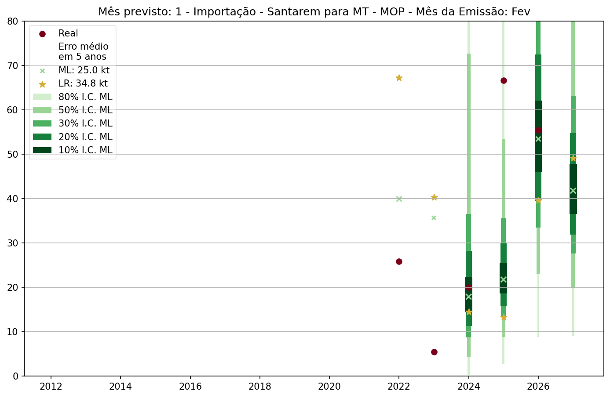
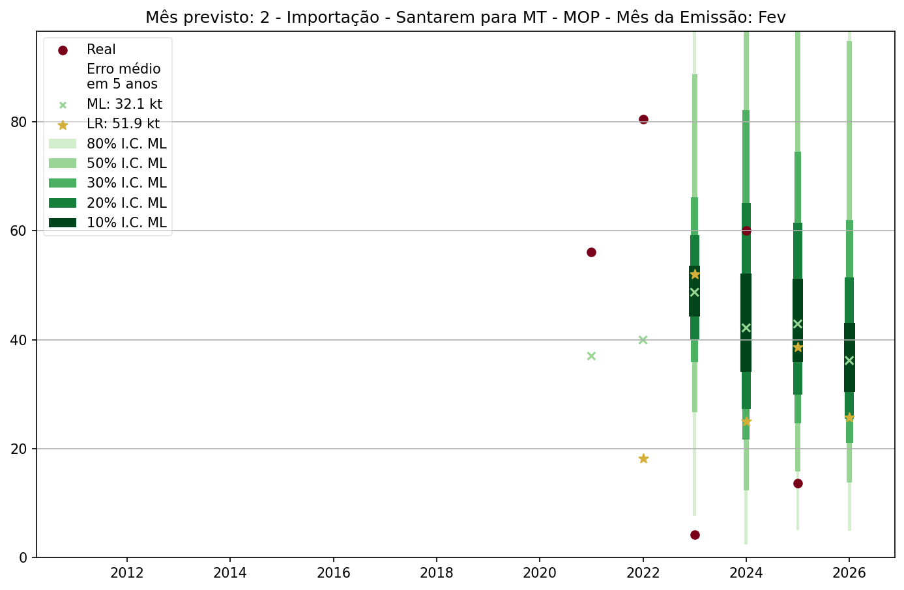
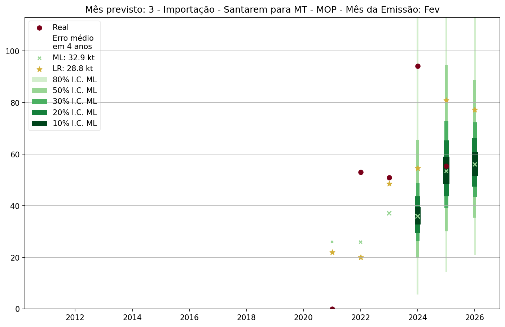
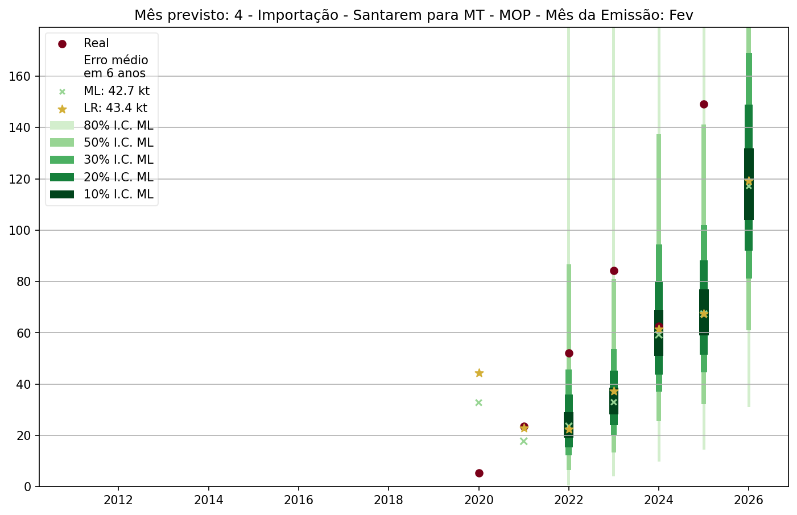
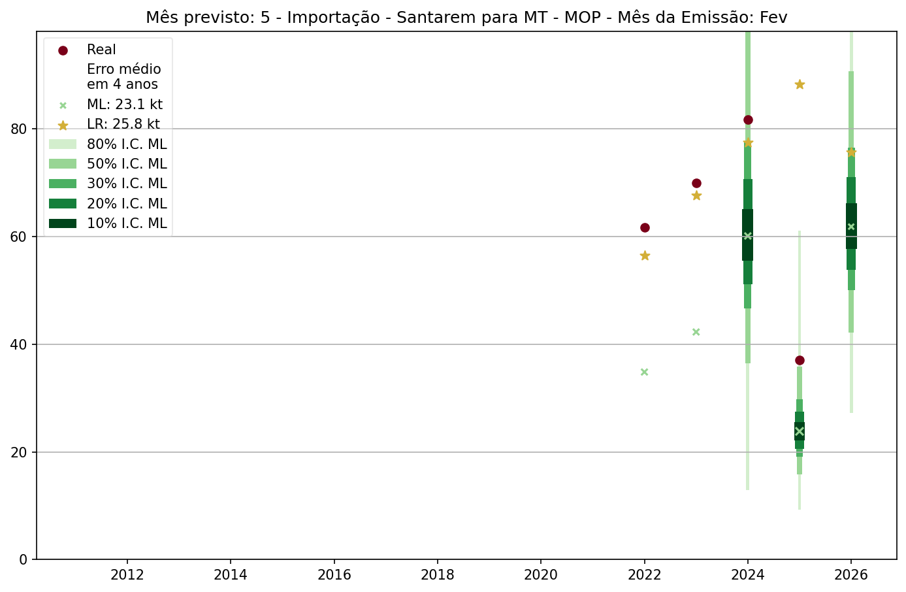
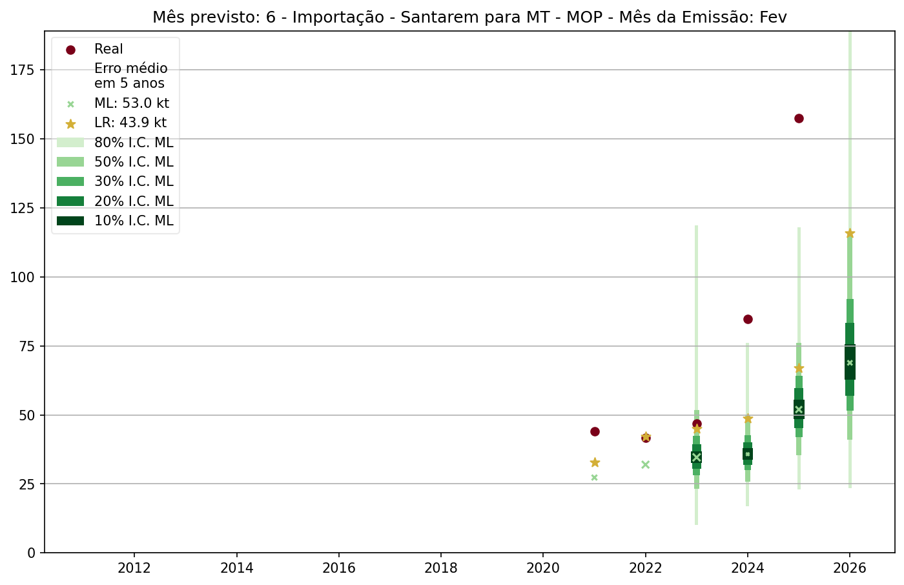
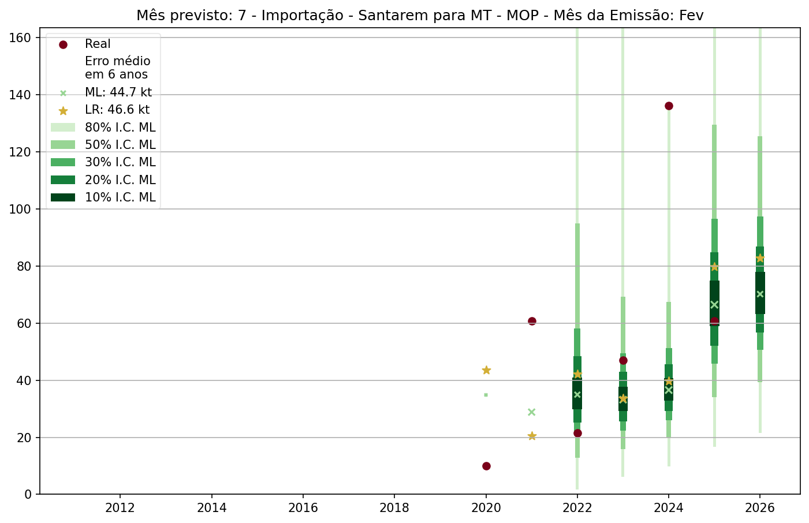
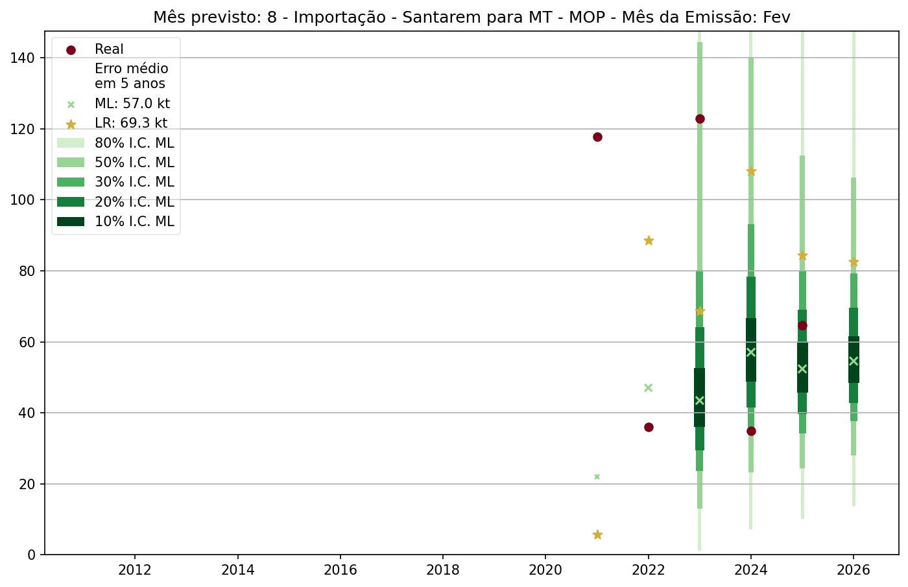
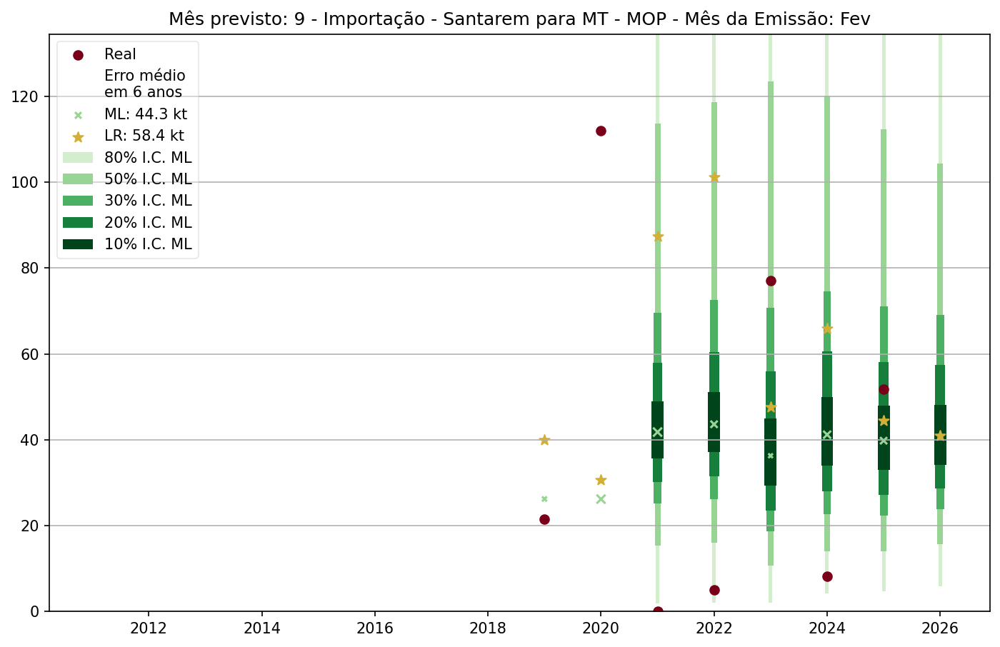
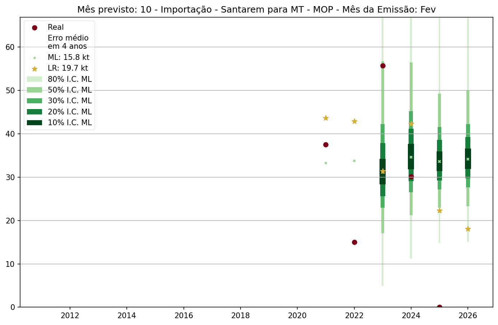
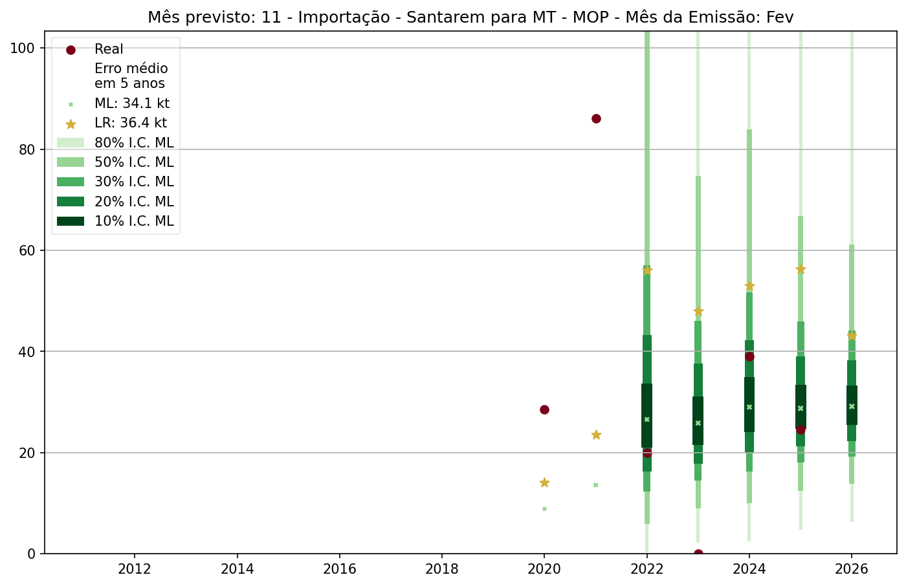
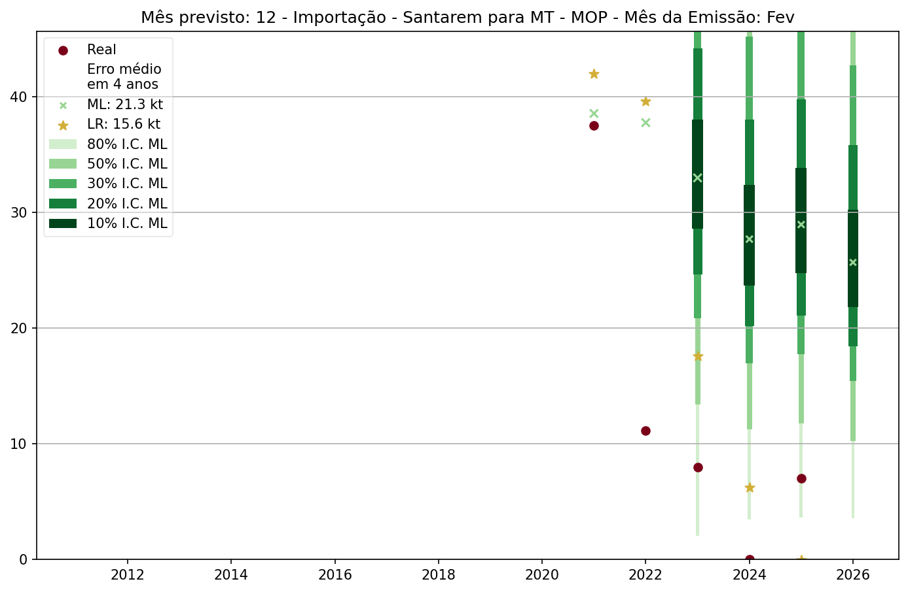

---  

## Principais fatores (ML)  

> 📊 **Seção fundamental para entender o modelo.**  
> A tabela abaixo apresenta a importância relativa das variáveis no algoritmo de Machine Learning.

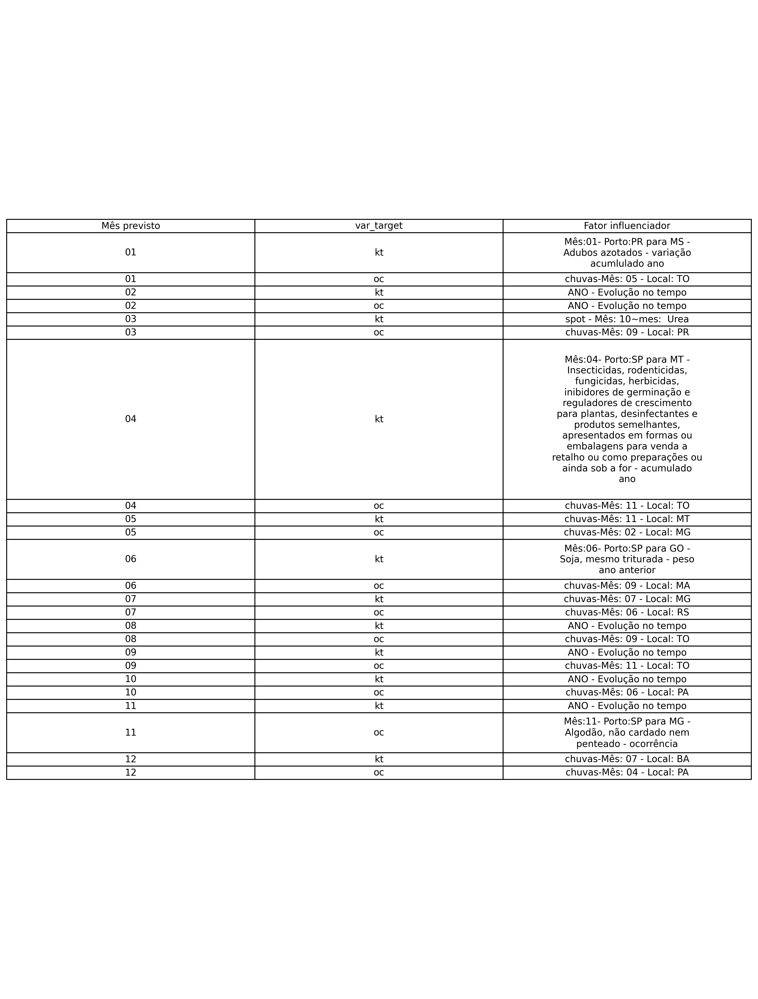  

---  

*Modelos utilizados: Machine Learning e Regressão Linear.*
